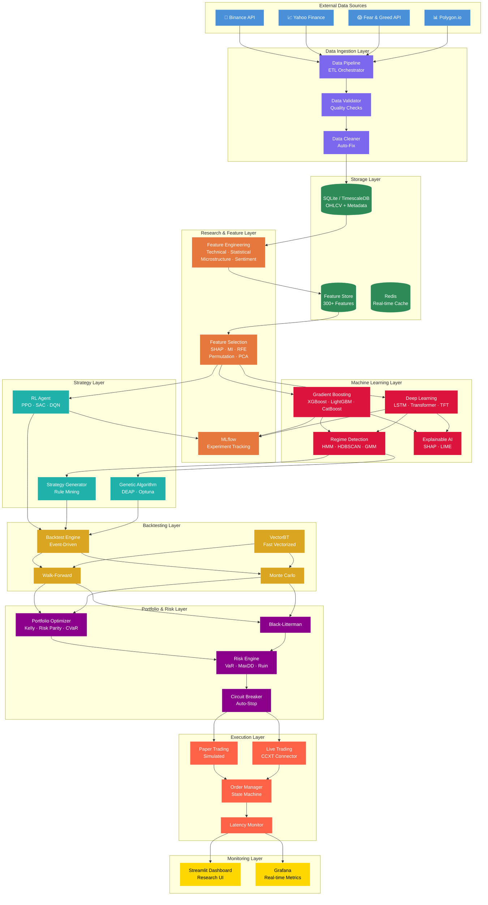
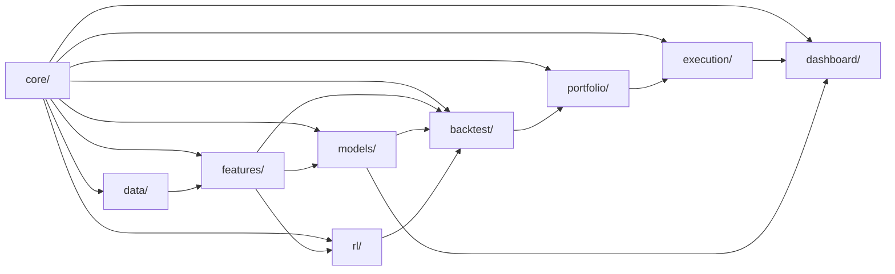
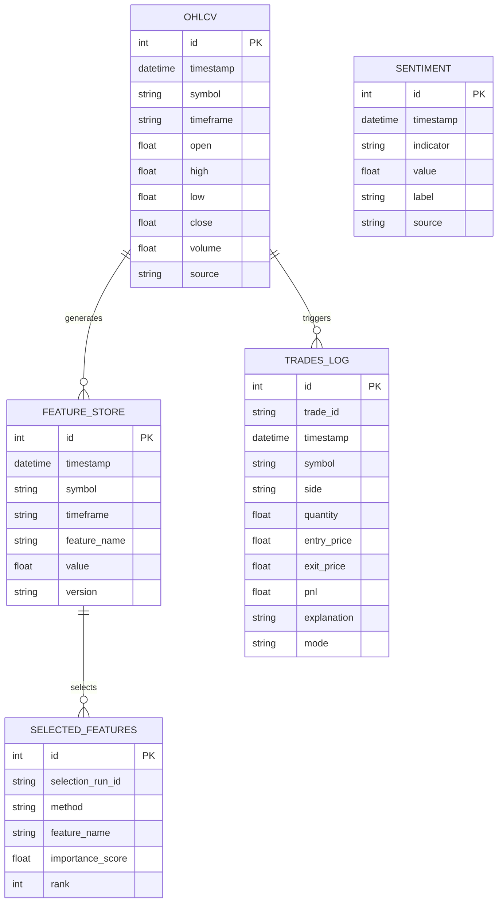

# QuantMind System Architecture

## Overview

QuantMind is a **modular, event-driven** quantitative trading platform designed as a personal institutional-grade research lab. The system follows a microservices-inspired architecture where each module communicates through a shared event bus and database.

## System Architecture Diagram

## Module Dependency Graph

## Data Flow

### Phase 1: Data Acquisition
1. **Providers** fetch raw data from APIs (Binance, Yahoo, etc.)
2. **Validator** checks data quality (gaps, nulls, OHLC logic)
3. **Cleaner** fixes issues (duplicates, negative volumes, OHLC violations)
4. **Storage** writes clean data to database with upsert semantics

### Phase 2: Feature Engineering
1. **Registry** discovers all registered feature functions
2. **Technical** computes 150+ TA indicators (SMA, RSI, MACD, BB, etc.)
3. **Statistical** computes advanced features (entropy, Hurst, Garman-Klass)
4. **Microstructure** computes market structure proxies (Amihud, Kyle's λ)
5. **Sentiment** integrates Fear & Greed, funding rate
6. **Store** persists features to the feature store

### Phase 3: Feature Selection & ML
1. **Selection** runs SHAP, MI, RFE, Permutation, PCA
2. **Consensus** ranking via Reciprocal Rank Fusion
3. **ML Lab** trains gradient boosting and deep learning models
4. **Regime Detection** labels market states (HMM, clustering)
5. **XAI** generates human-readable explanations

### Phase 4: Strategy & Execution
1. **RL Agent** learns trading policy via PPO/SAC/DQN
2. **Backtest** validates strategies with walk-forward + Monte Carlo
3. **Portfolio** optimizes allocation (Kelly, Risk Parity, CVaR)
4. **Risk Engine** enforces limits (VaR, MaxDD, circuit breaker)
5. **Execution** submits orders via paper or live broker

## Key Design Decisions

| Decision | Rationale |
|:---|:---|
| **SQLite → TimescaleDB** | Zero-setup local dev, production-ready upgrade path |
| **Feature Registry pattern** | Extensible, auto-documented, selective computation |
| **Event Bus** | Decoupled modules, easy to swap for Redis/Kafka |
| **Pydantic configs** | Type-safe, validated, IDE-friendly |
| **Abstract base classes** | Swappable implementations per module |
| **Upsert semantics** | Safe incremental data loading |

## Database Schema

